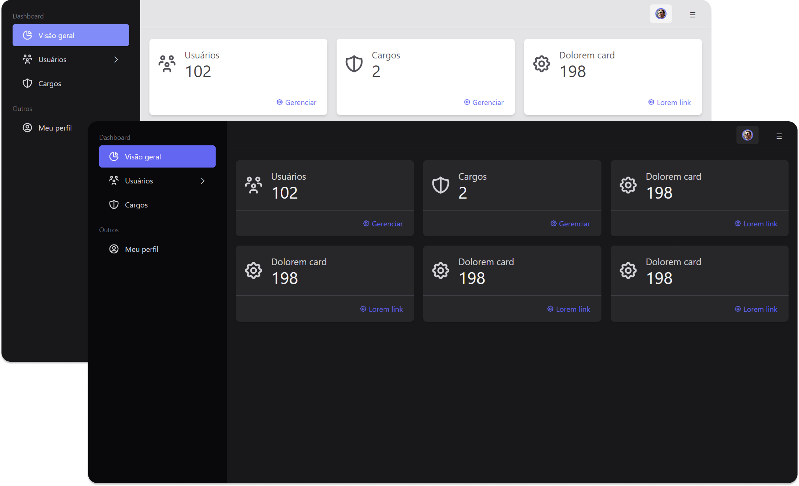

# TALL APP

Tall App é uma aplicação web usando a TallStack, conjunto de frameworks formado por Tailwind CSS, Alpine JS, Laravel e Livewire.

O Tall App foi criado com a finalidade de estudo das tecnologias envolvidas.

Esta aplicação se trata do desenvolvimento de, desde recursos básicos de autenticação à gerenciamento de usuários e cargos, atravéz de um painel administrativo, nele aplico conhecimentos adquiridos nestas tecnologias.

# SCREENSHOTS

## Admin Overview

## Dark and Light mode

## Admin Users List

## Admin User Edit

# RECURSOS DESENVOLVIDOS

1. Autenticação: login, registro, envio e reenvio de link de verificação de registro, envio de email de recuperação de senha;
2. Admin: camada administrativo com gerenciamento de usuários e cargos.

# REQUISITOS

-   PHP 8.1 ou superior
-   Composer 2.4.1 ou superior
-   Node v18.8.0 ou superior

# INSTALAÇÃO

(Em construção)
